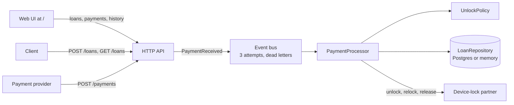
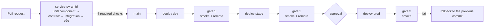

# Loan Platform QA Lab

A backend for phone loans, a small web UI on top of it, and the strategy for testing both: from unit tests to quality gates on the way through dev, stage and prod.

A customer takes a phone on credit. Every payment buys days, and while there are days left the phone stays unlocked. When they run out, the device-lock partner (a simplified stand-in for Samsung Knox) locks it again. Once the full price is paid, the lock is removed for good.

## Service



Business rules:
- Every full daily rate buys a day; the rest is kept as credit and added to the next payment.
- A payment below the daily rate only adds to the credit: the phone stays as it is.
- The phone locks by itself exactly at `unlockedUntil`.
- When the whole price is paid, the loan is `PAID_OFF` and the phone is `RELEASED`.
- A payment redelivered with the same `paymentId` is not applied twice.

API:

| Method and path | Answer |
|---|---|
| `POST /loans` `{"deviceId","price","dailyRate"}` | `201` loan |
| `GET /loans?limit=N` | `200` `{"loans":[...]}`, newest first; limit 1–100, default 20 |
| `GET /loans/{id}` | `200` loan with `paid`, `balance`, `credit`, `status`, `deviceState`, `unlockedUntil` |
| `GET /loans/{id}/payments` | `200` `{"loanId","payments":[...]}` with `APPLIED` or `LOAN_ALREADY_PAID_OFF` |
| `POST /payments` `{"paymentId","loanId","amount"}` | `202` accepted, applied asynchronously |
| `GET /health` | `200` `{"status":"UP"}` |
| `GET /` | the web UI |

Errors are JSON: `{"error": "..."}` with `400` or `404`.

Stack: Java 21, the JDK's built-in HTTP server, Jackson, plain JDBC and Postgres 17 (without `DATABASE_URL` the service keeps data in memory).

## Test pyramid

| Level | What it checks | Tools | Tests | Runs |
|---|---|---|---|---|
| unit | unlock rules, the loan, the payment processor | JUnit 5, AssertJ, Mockito | 35 | every PR |
| component | event bus and processor together, fake partner | Awaitility | 5 | every PR |
| contract | what is sent to the partner; API responses against JSON schemas | WireMock, json-schema-validator | 18 | every PR |
| integration | the running service over HTTP, including the web UI page; the repository on a real Postgres | RestAssured, WireMock, Testcontainers | 59 | every PR |
| e2e | a customer's journey over several days of test clock | all of the above | 3 | every PR |
| smoke | the stand is up, the web UI is served, a loan is created, a payment goes through | RestAssured | 4 | after each deploy |
| remote | API regression on a deployed stand, including list and history | RestAssured | 15 | dev and stage |

`mvn test` runs the first five levels: 120 tests, 3 of them `@Disabled` tests of known bugs (see below).

### Test framework (`service/src/test/java/lab/qa`)

| Package | Contents |
|---|---|
| `tests/` | the tests; one package = one level = one `@Tag` |
| `dsl/` | `LoanSteps`, `PaymentSteps`: steps in business words; steps wait, assertions stay in the tests |
| `data/` | `TestData`: a unique IMEI and paymentId per test, the `aLoan()` builder |
| `clients/` | `LoansApi` (RestAssured), `KnoxStub` (WireMock), request and response models |
| `core/` | `BaseIT` starts the partner stub and the service; `RemoteBase` for stands; `TestClock`; `Config` |

Principles:
- Tests do not depend on each other or on order: data is unique, time comes from a controlled `TestClock`, and expected dates are derived from it, not hardcoded.
- The values that drive the result are visible in the test itself.
- Several checks of one result use soft assertions, so a failed test shows the whole picture.
- A known bug is pinned twice: a passing test of today's behaviour with `(F-xx)` in its name, and a `@Disabled("F-xx: …")` test of the expected one. When the bug is fixed, the first goes red and the second is enabled.

## Web UI

Open any stand in a browser, for example https://loan-platform-qa-lab.onrender.com. One page, plain HTML and JavaScript served by the service itself, no build step:
- open a loan and see it in the list of recent loans;
- pay any amount, use quick amounts (1 day, 3 days, half a day, pay off), or reuse the last payment id to show that a duplicate is ignored;
- watch the phone state, credit, balance and relock time change, and the payment history fill with `APPLIED` or `LOAN_ALREADY_PAID_OFF`.

A link with `#LN-…` opens that loan directly. The UI uses only the public API, so everything it shows is covered by the API tests.

## Fault injection

The service has four seeded bugs, off by default: `mvn test -Dlab.bugs=<bug>`. Each number is how many tests of that level go red (run on 2026-09-15).

| Bug | What it breaks | unit | component | contract | integration | e2e |
|---|---|---|---|---|---|---|
| `ROUNDING_UP` | days are rounded up | 8 | 2 | 0 | 2 | 1 |
| `DOUBLE_PROCESSING` | a repeated paymentId is applied again | 1 | 1 | 0 | 1 | 0 |
| `KNOX_EPOCH_DATE` | relockAt is sent to the partner as a number, not an ISO string | 0 | 0 | 2 | 1 | 2 |
| `ZERO_AMOUNT_ACCEPTED` | a payment of 0 KES is accepted | 0 | 0 | 0 | 1 | 0 |

No bug goes unnoticed, and the table shows which level catches each one earliest and cheapest.

## Findings

[BUGS.md](BUGS.md): 12 findings from exploratory testing (F-01…F-12) with steps, evidence and status. For example, a payment to a paid-off loan is accepted and the money disappears (F-01); a partner failure between unlock and relock leaves the phone unlocked for good (F-04). F-10 (HTML 404 outside the API) was fixed together with the web UI, and its disabled test was switched on.

## CI/CD and quality gates



- `main` accepts only pull requests: the four pyramid stages are required and direct pushes are blocked.
- Before the tests, each stage downloads dependencies in a separate step with retries, so a Maven Central outage does not look like a failed test.
- `delivery` promotes one and the same commit through the environments; prod needs an approval, and if gate 3 fails, prod rolls back by itself.
- `stand-tests` can be run by hand against any stand: Actions → `stand-tests` → Run workflow.
- Coverage is measured by JaCoCo in every pyramid job and merged in `service-coverage`: four JVMs on four machines, one number. The run page shows it as a table; the HTML report is the `jacoco-report` artifact of the run. Locally, `mvn test` writes the same report for the levels it ran to `service/target/site/jacoco/index.html`.

| Environment | Stand | Database |
|---|---|---|
| dev | https://loan-platform-qa-lab.onrender.com | Neon, Frankfurt, Postgres 17 |
| stage | https://loan-platform-stage.onrender.com | separate Neon project |
| prod | https://loan-platform-prod.onrender.com | separate Neon project |

Stands on Render's free tier fall asleep: the first request can take up to a minute, and the stand tests wait for it.

## Running

Requires JDK 21+, Maven and Docker (Testcontainers starts Postgres for the integration tests).

```bash
cd service
mvn test                                      # unit, component, contract, integration, e2e
mvn test -Dgroups=unit                        # one level
mvn test -Dgroups="integration | e2e"         # several levels
mvn test -Dtest=UnlockPolicyTest              # one class
mvn test -Dlab.bugs=KNOX_EPOCH_DATE           # turn on a seeded bug

# against a deployed stand
mvn test -Dgroups="smoke | remote" -DexcludedGroups= -Dlab.baseUrl=https://loan-platform-qa-lab.onrender.com -Dlab.asyncTimeoutSeconds=30
```

The service locally: `docker build -t loans service && docker run -p 8080:8080 loans`, then open http://localhost:8080 for the UI or `curl localhost:8080/health`.

## Tools

Keys and connection strings live in `.env` at the repository root: it is not committed, and [.env.example](.env.example) lists the variables.

```bash
tools/db.sh --env dev tables                  # tables and row counts (psql from Docker, read-only)
tools/db.sh --env dev loans 10                # latest loans
tools/db.sh --env dev payments LN-6954bb4f    # payments of a loan: APPLIED, LOAN_ALREADY_PAID_OFF
tools/db.sh --env prod sql "SELECT count(*) FROM loans"
tools/render.sh live-commit <service-id>      # which commit a stand is running
```
