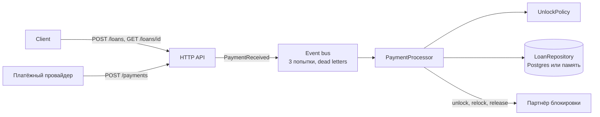
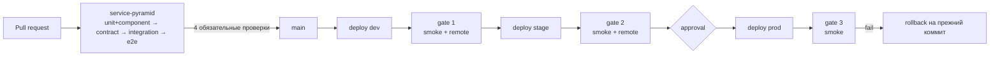

# Loan Platform QA Lab

Бэкенд кредитной платформы для телефонов в рассрочку и стратегия его тестирования: от unit-тестов до quality gates при выкатке на dev, stage и prod.

Клиент берёт телефон в кредит. Каждый платёж покупает дни: пока они есть, телефон разблокирован. Когда дни кончаются, партнёр по блокировке (упрощённый аналог Samsung Knox) снова его блокирует. После выплаты полной цены блокировка снимается навсегда.

## Сервис



Бизнес-правила:
- Каждая полная дневная ставка покупает день; остаток копится как кредит и добавляется к следующему платежу.
- Платёж меньше ставки только пополняет кредит: телефон остаётся как есть.
- Телефон блокируется сам ровно в момент `unlockedUntil`.
- Когда оплачена вся цена, займ `PAID_OFF`, телефон `RELEASED`.
- Повторная доставка платежа с тем же `paymentId` не применяется второй раз.

Стек: Java 21, HTTP-сервер из JDK, Jackson, plain JDBC и Postgres 17 (без `DATABASE_URL` сервис хранит данные в памяти).

## Тестовая пирамида

| Уровень | Что проверяет | Инструменты | Тестов | Где идёт |
|---|---|---|---|---|
| unit | правила разблокировки, займ, процессор платежей | JUnit 5, AssertJ, Mockito | 35 | каждый PR |
| component | шина событий и процессор вместе, партнёр — фейк | Awaitility | 5 | каждый PR |
| contract | что уходит партнёру; ответы API против JSON-схем | WireMock, json-schema-validator | 16 | каждый PR |
| integration | запущенный сервис по HTTP; репозиторий на реальном Postgres | RestAssured, WireMock, Testcontainers | 43 | каждый PR |
| e2e | путь клиента за несколько дней тестовых часов | всё выше | 3 | каждый PR |
| smoke | стенд жив, займ создаётся, платёж проходит | RestAssured | 3 | после деплоя |
| remote | регрессия API на развёрнутом стенде | RestAssured | 13 | dev и stage |

`mvn test` запускает первые пять уровней: 102 теста, 4 из них — `@Disabled` известных багов (см. ниже).

### Каркас тестов (`service/src/test/java/lab/qa`)

| Пакет | Что внутри |
|---|---|
| `tests/` | тесты; один пакет = один уровень = один `@Tag` |
| `dsl/` | `LoanSteps`, `PaymentSteps`: шаги словами бизнеса; шаги ждут, проверки остаются в тестах |
| `data/` | `TestData`: уникальные IMEI и paymentId на каждый тест, билдер `aLoan()` |
| `clients/` | `LoansApi` (RestAssured), `KnoxStub` (WireMock), модели запросов и ответов |
| `core/` | `BaseIT` поднимает стаб партнёра и сервис; `RemoteBase` для стенда; `TestClock`; `Config` |

Принципы:
- Тесты не зависят друг от друга и от порядка: данные уникальны, время — управляемые `TestClock`, ожидаемые даты считаются от них, а не хардкодятся.
- Значения, от которых зависит результат, видны в самом тесте.
- Несколько проверок одного результата — через soft assertions, чтобы упавший тест показывал всю картину.
- Известный баг закреплён дважды: зелёный тест текущего поведения с `(F-xx)` в названии и `@Disabled("F-xx: …")` тест ожидаемого. Когда баг починят, первый покраснеет, второй включат.

## Fault injection

В сервис встроены четыре бага, по умолчанию выключены: `mvn test -Dlab.bugs=<баг>`. Число — сколько тестов уровня краснеет (прогон 2026-09-15).

| Баг | Что ломает | unit | component | contract | integration | e2e |
|---|---|---|---|---|---|---|
| `ROUNDING_UP` | дни округляются вверх | 8 | 2 | 0 | 2 | 1 |
| `DOUBLE_PROCESSING` | повторный paymentId применяется снова | 1 | 1 | 0 | 1 | 0 |
| `KNOX_EPOCH_DATE` | relockAt уходит партнёру числом, а не ISO-строкой | 0 | 0 | 2 | 1 | 2 |
| `ZERO_AMOUNT_ACCEPTED` | платёж на 0 KES принимается | 0 | 0 | 0 | 1 | 0 |

Ни один баг не проходит незамеченным, и видно, какой уровень ловит его раньше и дешевле всего.

## Находки

[BUGS.md](BUGS.md): 12 находок исследовательского тестирования (F-01…F-12) с шагами, доказательствами и статусом. Например, платёж на уже выплаченный займ принимается, а деньги пропадают (F-01); сбой партнёра между unlock и relock оставляет телефон разблокированным навсегда (F-04).

## CI/CD и quality gates



- В `main` попадают только pull request'ы: четыре стадии пирамиды обязательны, прямой push запрещён.
- Перед тестами каждая стадия отдельным шагом скачивает зависимости с повторами: сбой Maven Central не выглядит как упавший тест.
- `delivery` выкатывает один и тот же коммит по окружениям; на prod нужен approve, при провале gate 3 prod откатывается сам.
- `stand-tests` можно запустить руками против любого стенда: Actions → `stand-tests` → Run workflow.

| Окружение | Стенд | База |
|---|---|---|
| dev | https://loan-platform-qa-lab.onrender.com | Neon, Франкфурт, Postgres 17 |
| stage | https://loan-platform-stage.onrender.com | отдельный проект Neon |
| prod | https://loan-platform-prod.onrender.com | отдельный проект Neon |

Стенды на бесплатном тарифе Render засыпают: первый запрос может идти до минуты, тесты стенда это ждут.

## Запуск

Нужны JDK 21+, Maven и Docker (Testcontainers поднимает Postgres для integration-тестов).

```bash
cd service
mvn test                                      # unit, component, contract, integration, e2e
mvn test -Dgroups=unit                        # один уровень
mvn test -Dgroups="integration | e2e"         # несколько уровней
mvn test -Dtest=UnlockPolicyTest              # один класс
mvn test -Dlab.bugs=KNOX_EPOCH_DATE           # включить засеянный баг

# против развёрнутого стенда
mvn test -Dgroups="smoke | remote" -DexcludedGroups= -Dlab.baseUrl=https://loan-platform-qa-lab.onrender.com -Dlab.asyncTimeoutSeconds=30
```

Сервис локально: `docker build -t loans service && docker run -p 8080:8080 loans`, затем `curl localhost:8080/health`.

## Инструменты

Ключи и строки подключения лежат в `.env` в корне: в git он не попадает, список переменных — в [.env.example](.env.example).

```bash
tools/db.sh --env dev tables                  # таблицы и число строк (psql из Docker, только чтение)
tools/db.sh --env dev loans 10                # последние займы
tools/db.sh --env dev payments LN-6954bb4f    # платежи по займу: APPLIED, LOAN_ALREADY_PAID_OFF
tools/db.sh --env prod sql "SELECT count(*) FROM loans"
tools/render.sh live-commit <service-id>      # какой коммит сейчас на стенде
```
